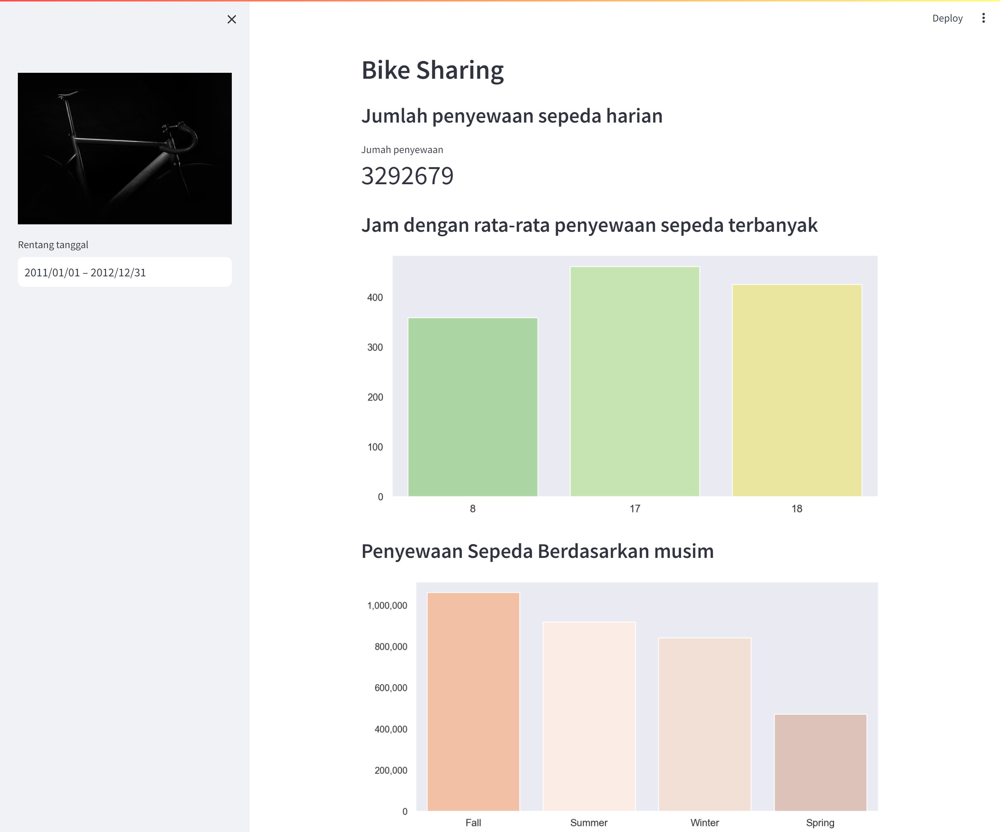

# Proyek Akhir Dicoding - Belajar Analisis Data Dengan Python
## Proyek Analisa Data
Proyek ini dibuat sebagai ketentuan untuk lulus kelas Belajar Analisis Data Dengan Python, aplikasi sendiri berbentuk dalam dashboard yang dideploy in *streamlit*
## Deksripsi Singkat Proyek
Proyek ini menganalisa bagian data hour.csv dari bike sharing analysis. Tujuan akhir dari analisa ini adalah mengetahui berapa jumlah penyewaan harian dan
beberapa *insight* menarik didalam data
## Struktur Direktori
- /data berisi data mentah yang digunakan dalam proyek
- /dashboard berisi dashboard.py yang digunakan untuk membuat hasil analisis data serta dataset yang sudah selesai di *assess* dan *cleaning*
- notebook.ipynb adalah *notebook* yang digunakan dalam analisa data

## Langkah Instalasi
1. Silahkan Clone Repository ini ke *local computer* anda, lakukan langkah dibawah ini
   ```shell
   git clone https://github.com/rzad20/bike_sharing_analysis
   ```
2.  Install Python (Jika anda belum memilikinya). jika ada sudah memiliki *environment* python. silahkan jalankan perintah berikut untuk menginstall pustaka yang dibutuhkan
   ```shell
   pip install -r requirements.txt
   ```
## Penggunaan
1. Masuk ke direktori proyek local anda :
   ```shell
   cd bike_sharing_analysis/dashboard/
   streamlit run dashboard.py
   ```
   anda bisa melihat aplikasi yang telah dideploy di streamlit dalam [link ini](https://bikesharinganalysisadit123499.streamlit.app/)
## Preview
berikut tampilah dashboard terkait

